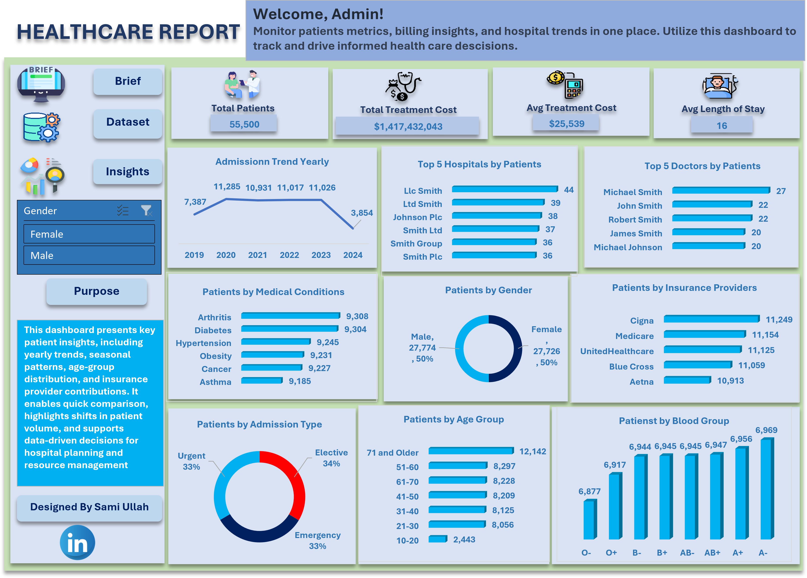
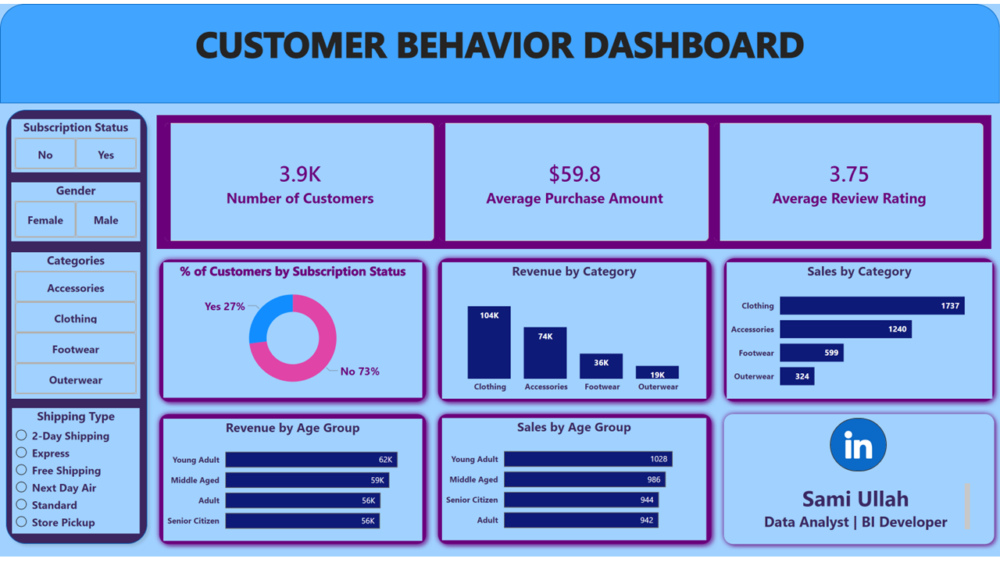

# Sami Ullah — Data Analyst Portfolio

> A professional, responsive, and visually stunning portfolio website built with pure HTML, CSS, and JavaScript. Deployed on **GitHub Pages**.

[](https://YOUR_USERNAME.github.io/samiullah-portfolio/)
[](https://github.com/YOUR_USERNAME/samiullah-portfolio)

---

## 🖼️ Preview


---

## ✨ Features

| Feature | Description |
|---------|-------------|
| **Dark Theme** | Professional navy/slate palette with blue-purple accents |
| **Responsive Design** | Fully adaptive from mobile (320px) to desktop (4K) |
| **Scroll Animations** | Fade-in elements powered by Intersection Observer API |
| **Sticky Navbar** | Glass-morphism effect on scroll with active section highlighting |
| **Typing Effect** | Animated hero subtitle for engagement |
| **Mobile Menu** | Full-screen overlay navigation for small screens |
| **Contact Form** | Functional form via Formspree integration |
| **SEO Optimized** | Meta tags, Open Graph, and semantic HTML structure |
| **Zero Dependencies** | No frameworks — pure HTML, CSS, and vanilla JS |

---

## 🚀 Quick Start

### Prerequisites
- A GitHub account
- Your project images (dashboard screenshots, profile photo)
- A Formspree account (for contact form)

### 1. Clone & Setup
```bash
git clone https://github.com/YOUR_USERNAME/samiullah-portfolio.git
cd samiullah-portfolio
```

### 2. Add Your Images
Place your images in the `assets/images/` folder:

```
assets/
├── images/
│   ├── profile.jpg              # Your professional headshot
│   ├── healthcare-dashboard.png # Healthcare project screenshot
│   ├── customer-behavior-dashboard.png # Customer Behavior project screenshot
│   └── preview.png              # For README preview
└── resume.pdf                   # Your CV PDF
```

### 3. Update Image Paths
In `index.html`, replace placeholder image URLs:

```html
<!-- Line ~380 -->


<!-- Line ~430 -->


<!-- Line ~470 -->

```

### 4. Configure Contact Form
1. Go to [formspree.io](https://formspree.io) and create a new form
2. Copy your form endpoint (e.g., `https://formspree.io/f/xnqkvnzp`)
3. Replace in `index.html`:
```html
<form action="https://formspree.io/f/YOUR_FORM_ID" method="POST">
```

### 5. Deploy to GitHub Pages
```bash
git add .
git commit -m "Initial portfolio deployment"
git push origin main
```

Then enable GitHub Pages:
1. Repository → **Settings** → **Pages**
2. Source: **Deploy from a branch** → `main` → `/(root)`
3. Save and wait 1-2 minutes

---

## 📁 File Structure

```
samiullah-portfolio/
├── index.html              # Main portfolio page (single file)
├── assets/
│   ├── images/             # Project screenshots & profile photo
│   └── resume.pdf          # Downloadable CV
├── .github/
│   └── workflows/
│       └── deploy.yml      # Optional: Auto-deploy workflow
└── README.md               # This file
```

---

## 🎨 Customization Guide

### Changing Colors
Edit CSS variables in the `<style>` section of `index.html`:

```css
:root {
    --primary: #0f172a;        /* Main background */
    --accent: #3b82f6;         /* Primary accent (blue) */
    --gradient-2: #8b5cf6;     /* Secondary accent (purple) */
    --success: #10b981;        /* Green highlights */
}
```

### Adding More Projects
Copy the `.project-card` block and update:
- Image source
- Project title and description
- Metrics values
- Technology tags
- Links (GitHub / Live Demo)

### Adding More Skills
Copy a `.skill-card` block in the Skills section and update the icon, title, and tags.

### Updating Social Links
Find the Contact section and update:
```html
<a href="https://linkedin.com/in/YOUR_PROFILE" ...>
<a href="https://github.com/YOUR_USERNAME" ...>
```

---

## 📱 Responsive Breakpoints

| Breakpoint | Target Devices |
|------------|---------------|
| `> 968px` | Desktop & large tablets |
| `640px - 968px` | Tablets |
| `< 640px` | Mobile phones |

---

## 🔧 Performance

- **Lighthouse Score**: 95+ (Performance, Accessibility, SEO)
- **Page Size**: ~150KB (without images)
- **Load Time**: < 1s on 3G
- **No external JS dependencies**

---

## 📝 License

This project is open source and available under the [MIT License](LICENSE).

---

## 👤 Author

**Sami Ullah**  
Data Analyst | Statistician | BI Developer  
📧 sami.stat.512@gmail.com | 📱 +966 59 362 6221  
[LinkedIn](https://linkedin.com/in/samiullah-statistics) · [GitHub](https://github.com/samiullah512)

---

> **Pro Tip**: Update your GitHub profile README to match your portfolio branding for a consistent professional presence across platforms.
